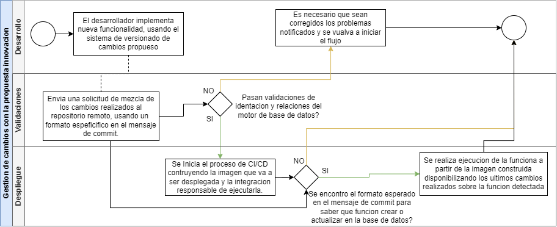
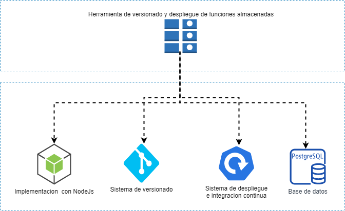

# Herramienta de versionado y despliegue en múltiples ambientes de funciones almacenadas para el motor de base de datos postgresSQL
Demo para propuesta de versionado y despliegue de procedimientos almacenados en postgresql

### Descripcion

- Se requiere investigar, analizar, diseñar e implementar, una herramienta que permita el versionado y despliegue (en múltiples ambientes) de las funciones del motor de base de datos postgresql, con los objetivos de:
-	Lograr realizar la homologación de ambientes pre productivos y productivos,
-	Obtener un manejo organizado
-	Preservar el control histórico de cambios y versiones
-	Controlar las modificaciones tradicionales de dichas funciones, que normalmente son realizadas directamente por los administradores y gestores de la base de datos, y llevarlas a un proceso de integración continua, en donde cada cambio recibe una revisión y aprobación por parte del equipo desarrollador.


## Ejecute localmente

>Clone el proyecto

```bash
  git clone https://github.com/JulianOcampo/versionado-y-despliegue-sp
```

>Dirijase a la ruta del proyect

```bash
  cd versionado-y-despliegle-sp
```

>Instalar dependencias

```bash
 npm install --save
```

>Ejecutar cambios

```bash
 node .\src\execute.js
```

## Images

>Diagrama de secuencia



>Estructura deseada




>  :mechanical_arm: Love what you do :mechanical_arm: 
